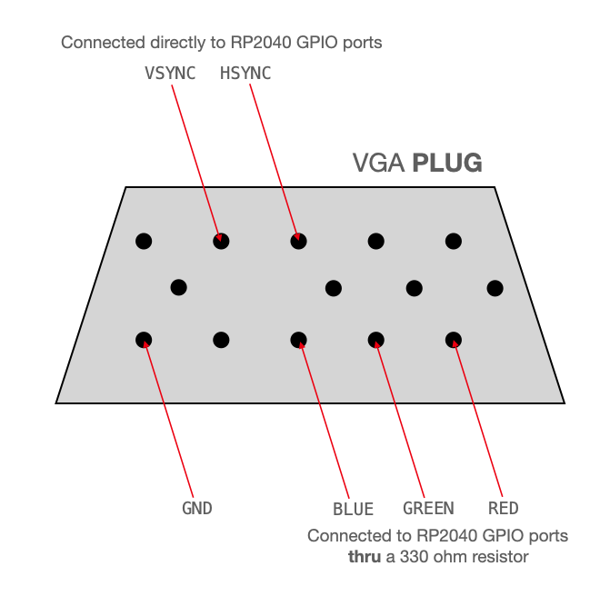

# pico_chip8

A chip8 emulator for raspberry pi pico with VGA out

## Wiring

The code was made originally for the **[Adafruit Feather RP2040](https://learn.adafruit.com/adafruit-feather-rp2040-pico)** beacause that the wiring is like this:
* Columns of keypad matrix are connected to 7 - 10 GPIO pins.
* Rows of keypad matrix are connected to 26 - 29 GPIO pins.
* HSYNC pin is gpio 24.
* VSYNC pin is gpio 25.
* RED, GREEN and BLUE pin are 18, 19, 20 GPIOs respectively. **They needs 330 Ohms resistors**.
 

## Example

## Acknowledgements

* [Queso Fuego](https://www.youtube.com/watch?v=YvZ3LGaNiS0) for chip8 emulator tutorial videos.
* [Van Hunter Adams ](https://vanhunteradams.com/Pico/VGA/VGA.html) for VGA pio library.
